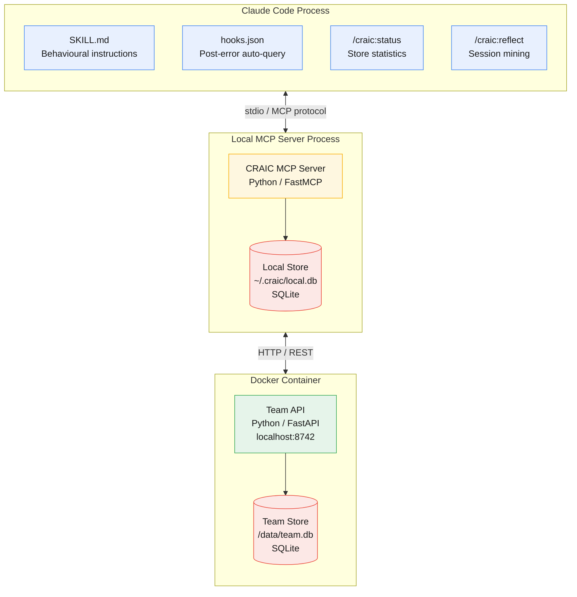

# CRAIC

**Collective Reciprocal Agent Intelligence Commons**

An open standard for shared agent learning. Agents persist, share, and query collective knowledge so they stop rediscovering the same failures independently.

## Architecture

CRAIC runs across three runtime boundaries: the agent process (plugin configuration), a local MCP server (knowledge logic and private store), and a Docker container (team-shared API).

See [`docs/architecture.md`](docs/architecture.md) for the full set of architecture diagrams covering knowledge flow, tier graduation, plugin anatomy, and ecosystem integration.

## Status

Exploratory. See [`docs/`](docs/) for the proposal and PoC design.

## License

Apache 2.0 — see [LICENSE](LICENSE).
