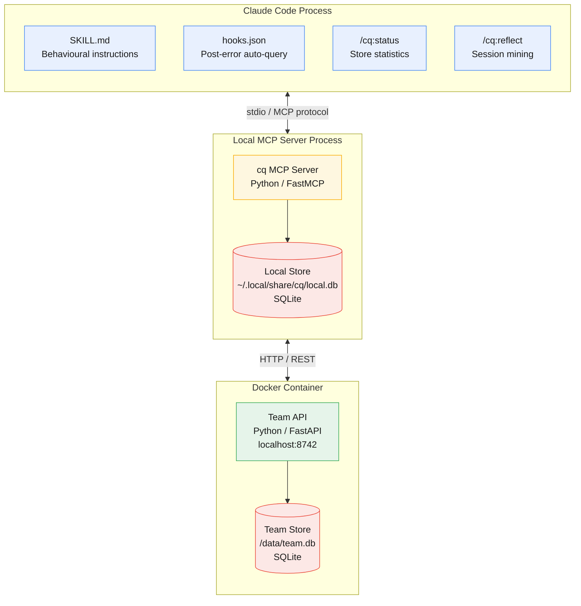

# cq

**cq** is derived from *colloquy* (/ˈkɒl.ə.kwi/), a structured exchange of ideas where understanding emerges through dialogue rather than one-way output. It reflects a focus on reciprocal knowledge sharing; systems that improve through participation, not passive use. In radio, **CQ** is a general call ("any station, respond"), capturing the same model: open invitation, response, and collective signal built through interaction.

Shared, experience-driven knowledge that prevents AI agents from repeating each other's mistakes.

An open standard for shared agent learning. Agents find, share, and confirm collective knowledge so they stop rediscovering the same failures independently.

## Installation

Requires: `uv`

### Claude Code (plugin)

```
claude plugin marketplace add mozilla-ai/cq
claude plugin install cq
```

Or from a cloned repo:

```bash
make install-claude
```

To uninstall:

```
claude plugin marketplace remove cq
```

Or from a cloned repo:

```bash
make uninstall-claude
```

If you configured team sync, you may also want to remove `CQ_TEAM_ADDR` and `CQ_TEAM_API_KEY` from `~/.claude/settings.json`.

### OpenCode (MCP server)

Also requires: `jq`

```bash
git clone https://github.com/mozilla-ai/cq.git
cd cq
make install-opencode
```

Or for a specific project:

```bash
make install-opencode PROJECT=/path/to/your/project
```

To uninstall:

```bash
make uninstall-opencode
# or for a specific project:
make uninstall-opencode PROJECT=/path/to/your/project
```

If you configured team sync, you may also want to remove the `environment` block from the cq entry in your OpenCode config.

## Configuration

cq works out of the box in **local-only mode** with no configuration. Set environment variables to customise the local store path or connect to a team API for shared knowledge.

| Variable | Required | Default | Purpose |
|----------|----------|---------|---------|
| `CQ_LOCAL_DB_PATH` | No | `~/.local/share/cq/local.db` | Path to the local SQLite database (follows [XDG Base Directory spec](https://specifications.freedesktop.org/basedir/latest/); respects `$XDG_DATA_HOME`) |
| `CQ_TEAM_ADDR` | No | *(disabled)* | Team API URL. Set to enable team sync (e.g. `http://localhost:8742`) |
| `CQ_TEAM_API_KEY` | When team configured | — | API key for team API authentication |

When `CQ_TEAM_ADDR` is unset or empty, cq runs in local-only mode and knowledge stays on your machine. Set it to a team API URL to enable shared knowledge across your team while keeping a durable local copy.

## Storage Semantics

cq always keeps a machine-local knowledge store. Team sync adds a shared store; it does not replace the local one.

- `query` reads the local store first and, when `CQ_TEAM_ADDR` is configured and reachable, also queries the team API. Results are merged, deduplicated by knowledge-unit ID, and returned with a `source` value showing whether they came from `local`, `team`, or `both`.
- `propose` stores the new knowledge unit locally first. If team sync is configured, cq then submits the same knowledge unit to the team API using the same ID.
- If the team API is unreachable, the local copy remains stored and is marked for retry.
- If the team API rejects the shared submission, the local copy still remains stored; rejection affects team sharing, not machine-local durability.
- Team query visibility depends on the team review workflow. A proposal can be submitted to the team API immediately but may not appear in team query results until it is approved there.

### Claude Code

Add variables to `~/.claude/settings.json` under the `env` key:

```json
{
  "env": {
    "CQ_TEAM_ADDR": "http://localhost:8742",
    "CQ_TEAM_API_KEY": "your-api-key"  # pragma: allowlist secret
  }
}
```

### OpenCode

Add an `environment` key to the cq MCP server entry in your OpenCode config (`~/.config/opencode/opencode.json` or `<project>/.opencode/opencode.json`):

```json
{
  "mcp": {
    "cq": {
      "type": "local",
      "command": ["uv", "run", "--directory", "/path/to/cq/plugins/cq/server", "cq-mcp-server"],
      "environment": {
        "CQ_TEAM_ADDR": "http://localhost:8742",
        "CQ_TEAM_API_KEY": "your-api-key"  # pragma: allowlist secret
      }
    }
  }
}
```

Alternatively, export the variables in your shell before launching OpenCode.

## Architecture

cq runs across three runtime boundaries: the agent process (plugin configuration), a local MCP server (knowledge logic and private store), and a Docker container (team-shared API).



See [`docs/architecture.md`](docs/architecture.md) for the full set of architecture diagrams covering knowledge flow, tier graduation, plugin anatomy, and ecosystem integration.

## Status

Exploratory. See [`docs/`](docs/) for the proposal and PoC design.

## Contributing

See [CONTRIBUTING.md](CONTRIBUTING.md) for contribution guidelines, [DEVELOPMENT.md](DEVELOPMENT.md) for dev environment setup, and [SECURITY.md](SECURITY.md) for our security policy.

## License

Apache 2.0 — see [LICENSE](LICENSE).
