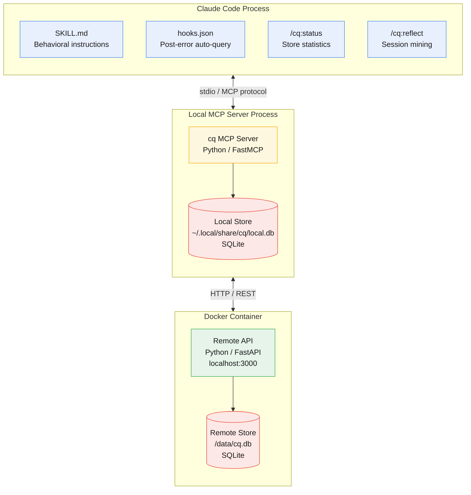

# cq

**cq** is derived from *colloquy* (/ˈkɒl.ə.kwi/), a structured exchange of ideas where understanding emerges through dialogue rather than one-way output. It reflects a focus on reciprocal knowledge sharing; systems that improve through participation, not passive use. In radio, **CQ** is a general call ("any station, respond"), capturing the same model: open invitation, response, and collective signal built through interaction.

Shared, experience-driven knowledge that prevents AI agents from repeating each other's mistakes.

An open standard for shared agent learning. Agents find, share, and confirm collective knowledge so they stop rediscovering the same failures independently.

## Installation

Requires: `uv`, Python 3.11+

Optional (for Go SDK and Go CLI): `go` 1.26+

### Claude Code (plugin)

```
claude plugin marketplace add mozilla-ai/cq
claude plugin install cq
```

Or from a cloned repo:

```bash
make install-claude
```

Note: Claude runs the plugin from its own installed plugin root (via
`CLAUDE_PLUGIN_ROOT`), so `scripts/bootstrap.py` and `.claude-plugin/plugin.json`
are resolved from that managed install location, not from your repository
checkout. The `cq` binary cache is shared per user under the XDG data runtime
path (`$XDG_DATA_HOME/cq/runtime`, fallback `~/.local/share/cq/runtime`).

To uninstall:

```
claude plugin marketplace remove cq
```

Or from a cloned repo:

```bash
make uninstall-claude
```

If you configured remote sync, you may also want to remove `CQ_ADDR` and `CQ_API_KEY` from `~/.claude/settings.json`.

### Installer and Plugin Environment Variables

These variables are used by the multi-host installer and plugin bootstrap runtime.

| Variable                 | Used by                      | Required                           | Default                            | Purpose                                                                         |
|--------------------------|------------------------------|------------------------------------|------------------------------------|---------------------------------------------------------------------------------|
| `CLAUDE_PLUGIN_ROOT`     | Claude plugin bootstrap      | No (provided by Claude at runtime) | fallback to script-relative path   | Points bootstrap to the Claude-managed installed plugin root.                   |
| `CQ_INSTALL_PLUGIN_ROOT` | Installer CLI                | No                                 | auto-detected `plugins/cq` in repo | Dev/test override for resolving plugin source tree during installer runs.       |
| `OPENCODE_CONFIG_DIR`    | Installer (OpenCode host)    | No                                 | `~/.config/opencode`               | Overrides OpenCode global config target directory for install/uninstall.        |
| `XDG_DATA_HOME`          | Installer + plugin bootstrap | No                                 | `~/.local/share`                   | Base data directory for shared cq runtime assets (`$XDG_DATA_HOME/cq/runtime`). |

Windows-only fallbacks:

| Variable       | Used by                                | Required | Default                                  | Purpose                                                       |
|----------------|----------------------------------------|----------|------------------------------------------|---------------------------------------------------------------|
| `APPDATA`      | Installer + plugin bootstrap (Windows) | No       | used if `LOCALAPPDATA` unset             | Secondary Windows fallback for shared runtime base directory. |
| `LOCALAPPDATA` | Installer + plugin bootstrap (Windows) | No       | `%USERPROFILE%\\AppData\\Local` fallback | Windows per-user fallback when `XDG_DATA_HOME` is unset.      |

### OpenCode (MCP server)

```bash
git clone https://github.com/mozilla-ai/cq.git
cd cq
make install-opencode
```

Or for a specific project:

```bash
make install-opencode PROJECT=/path/to/your/project
```

To uninstall:

```bash
make uninstall-opencode
# or for a specific project:
make uninstall-opencode PROJECT=/path/to/your/project
```

If you configured remote sync, you may also want to remove the `environment` block from the cq entry in your OpenCode config.

### Cursor

```bash
git clone https://github.com/mozilla-ai/cq.git
cd cq
make install-cursor
```

Or for a specific project:

```bash
make install-cursor PROJECT=/path/to/your/project
```

This writes:

- `~/.cursor/mcp.json` — adds the cq MCP server entry, preserving any other servers and any hand-added fields (such as `env`).
- `~/.cursor/rules/cq.mdc` — created on first install only; never overwritten if you've edited it.
- `~/.cursor/hooks.json` — four lifecycle hooks (sessionStart, postToolUse, postToolUseFailure, stop) pointing at the shared cq runtime copy.
- Shared runtime bundle — one per user, reused by all hosts:
  - macOS/Linux: `$XDG_DATA_HOME/cq/runtime/` (fallback `~/.local/share/cq/runtime/`)
  - Windows: `%LOCALAPPDATA%\\cq\\runtime\\`
- `~/.agents/skills/cq/` — the shared skill commons (see "Shared skills" below).

To uninstall:

```bash
make uninstall-cursor
# or for a specific project:
make uninstall-cursor PROJECT=/path/to/your/project
```

### Windsurf

```bash
git clone https://github.com/mozilla-ai/cq.git
cd cq
make install-windsurf
```

Windsurf has no per-project MCP config, so only a global install is supported. This writes:

- `~/.codeium/windsurf/mcp_config.json` — adds the cq MCP server entry.
- Shared runtime bundle — same path set as Cursor above, reused across hosts.
- `~/.agents/skills/cq/` — the shared skill commons.

To uninstall:

```bash
make uninstall-windsurf
```

### Shared skills

By default, every host install drops the cq skill into `~/.agents/skills/cq/` (or `<project>/.agents/skills/cq/` for project installs). All hosts discover skills from the `.agents/skills/` convention, so one shared copy is picked up by Cursor, Windsurf, and OpenCode without per-host duplication.

If you'd rather keep skills isolated per host, pass `--host-isolated-skills` to the installer directly:

```bash
cd scripts/install && uv run python -m cq_install install --target cursor --global --host-isolated-skills
```

### Windows

Windows doesn't ship `make`, so the Makefile targets aren't available. Use the PowerShell wrapper instead:

```powershell
.\scripts\install.ps1 install --target cursor --global
.\scripts\install.ps1 install --target windsurf --global
.\scripts\install.ps1 install --target opencode --global
```

Or invoke the installer directly:

```powershell
cd scripts\install
uv run python -m cq_install install --target cursor --global
```

Uninstall works the same way — replace `install` with `uninstall`. Config paths are home-directory-relative, same as POSIX (`Path.home()` resolves to `%USERPROFILE%` on Windows):

| Host | Windows path |
|---|---|
| Cursor | `%USERPROFILE%\.cursor\mcp.json` |
| Windsurf | `%USERPROFILE%\.codeium\windsurf\mcp_config.json` |
| OpenCode | `%USERPROFILE%\.config\opencode\opencode.json` |
| Shared skills | `%USERPROFILE%\.agents\skills\cq\` |

The installer writes the literal command `python` into the generated config on Windows (`python3` on POSIX) — whichever is canonical for the platform per [python.org docs](https://docs.python.org/3/using/windows.html). You need Python 3.11+ on `PATH` under that name for the MCP server to launch; the installer itself requires `uv`.

### Go SDK

```bash
go get github.com/mozilla-ai/cq/sdk/go
```

```go
import cq "github.com/mozilla-ai/cq/sdk/go"

client, err := cq.NewClient()
if err != nil {
    panic(err)
}
defer client.Close()

result, err := client.Query(ctx, cq.QueryParams{Domains: []string{"api", "stripe"}})
if err != nil {
    panic(err)
}

_ = result.Units
```

### Go CLI

#### via Homebrew

```bash
brew install mozilla-ai/tap/cq
```

#### via GitHub Releases

Download the latest binary from the [releases page](https://github.com/mozilla-ai/cq/releases).

Or install with `curl`:

```bash
# CLI releases are tagged cli/vX.Y.Z.
VERSION="cli/v0.1.0"
OS="$(uname -s)"
ARCH="$(uname -m)"
curl -sSL "https://github.com/mozilla-ai/cq/releases/download/${VERSION}/cq_${OS}_${ARCH}.tar.gz" | tar xz cq
sudo mv cq /usr/local/bin/
```

> **macOS Gatekeeper:** If macOS blocks the binary, remove the quarantine flag:
> ```
> xattr -d com.apple.quarantine /usr/local/bin/cq
> ```

#### From Source

```bash
git clone https://github.com/mozilla-ai/cq.git
cd cq/cli
make build
./cq --help
```

## Configuration

cq works out of the box in **local-only mode** with no configuration. Set environment variables to customize the local store path or connect to a remote API for shared knowledge.

| Variable | Required | Default | Purpose |
|----------|----------|---------|---------|
| `CQ_LOCAL_DB_PATH` | No | `~/.local/share/cq/local.db` | Path to the local SQLite database (follows [XDG Base Directory spec](https://specifications.freedesktop.org/basedir/latest/); respects `$XDG_DATA_HOME`) |
| `CQ_ADDR` | No | *(disabled)* | Remote API URL. Set to enable remote sync (e.g. `http://localhost:3000`) |
| `CQ_API_KEY` | When remote configured | — | API key for remote API authentication |

When `CQ_ADDR` is unset or empty, cq runs in local-only mode; knowledge stays on your machine. Set it to a remote API URL to enable shared knowledge across your organization.

### Claude Code

Add variables to `~/.claude/settings.json` under the `env` key:

```json
{
  "env": {
    "CQ_ADDR": "http://localhost:3000",
    "CQ_API_KEY": "your-api-key"  # pragma: allowlist secret
  }
}
```

### OpenCode

Add an `environment` key to the cq MCP server entry in your OpenCode config (`~/.config/opencode/opencode.json` or `<project>/.opencode/opencode.json`):

```json
{
  "mcp": {
    "cq": {
      "type": "local",
      "command": ["/path/to/cq", "mcp"],
      "environment": {
        "CQ_ADDR": "http://localhost:3000",
        "CQ_API_KEY": "your-api-key"  # pragma: allowlist secret
      }
    }
  }
}
```

Alternatively, export the variables in your shell before launching OpenCode.

## Knowledge tiers

cq organises knowledge units into three tiers that describe where a unit lives and who can see it:

- **local** — stored in your on-disk SQLite database (`~/.local/share/cq/local.db` by default). Never leaves your machine.
- **private** — stored on the remote API at `CQ_ADDR`, visible to everyone with access to that same remote. If you share a `CQ_ADDR` with teammates, they will see these units. "Private" here means private to that remote, not private to you.
- **public** — publicly shared on the open commons. Not yet available; planned for a later release.

Where knowledge units land:

- **No remote configured** (`CQ_ADDR` unset): new units are written to your local store.
- **Remote configured and reachable:** `propose` sends straight to the remote and the unit enters the `private` tier. It does not also appear in your local store.
- **Remote configured but unreachable:** cq falls back to writing the unit locally.

## Architecture

cq runs across three runtime boundaries: the agent process (plugin configuration), a local MCP server (knowledge logic and private store), and a Docker container (remote shared API).



See [`docs/architecture.md`](docs/architecture.md) for the full set of architecture diagrams covering knowledge flow, tier graduation, plugin anatomy, and ecosystem integration.

## Status

Exploratory — this is a `0.x.x` project. Expect breaking changes to the database format and SDK interfaces before v1. We'll provide migration scripts where possible so your knowledge units survive upgrades.

See [`docs/`](docs/) for the proposal and PoC design.

### Migrating from earlier releases

The local SQLite database format changed during the 0.x cycle (enum values, field names, ID format). If you have knowledge units from an earlier version, run the migration script to bring them up to date:

```bash
# Local SDK database (auto-detects path).
./server/scripts/migrate-v1.sh

# Explicit path.
./server/scripts/migrate-v1.sh ~/.local/share/cq/local.db

# Remote server running in a container.
docker compose exec cq-server bash /app/scripts/migrate-v1.sh
```

The script is idempotent — safe to run multiple times, on any 0.x database. It creates a backup before modifying anything. See the script header for full details.

## Contributing

See [CONTRIBUTING.md](CONTRIBUTING.md) for contribution guidelines, [DEVELOPMENT.md](DEVELOPMENT.md) for dev environment setup, and [SECURITY.md](SECURITY.md) for our security policy.

## License

Apache 2.0 — see [LICENSE](LICENSE).
